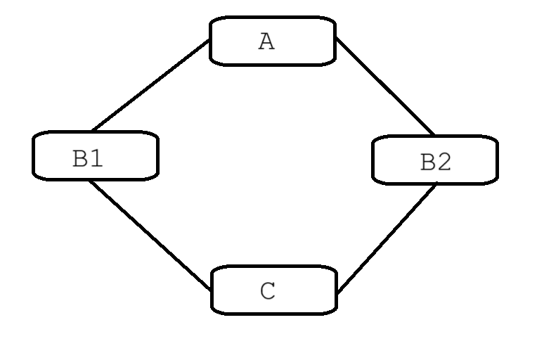

# Tutoriat 5 - Funcții virtuale, moștenirea în diamant

Funcțiile virtuale sunt funcții definite în clasa de bază și redefinite în clasa derivată. Faptul că sunt marcate ca fiind virtuale permite folosirea implementării din clasa derivată dintr-un pointer de tipul clasei de bază.

```cpp
class B {
public:
    void f() {
        cout << "B\n";
    }
};

class D : public B {
public:
    void f() {
        cout << "D\n";
    }
};

int main() {
    B *d = new D();
    d->f();
    delete d;
    return 0;
}
```

Codul de mai sus va afișa `B`, implementarea din clasa de bază.

```cpp
class B {
public:
    virtual void f() {
        cout << "B\n";
    }
};
```
În schimb, dacă marcăm funcția din `B` ca fiind virtuală, codul va afișa `D`.

Dacă o clasă conține o metodă virtuală aceasta va avea și un [`vtable`](https://en.wikipedia.org/wiki/Virtual_method_table) asociat. 
```cpp
int main() {
    B b;
    cout << sizeof(b) << '\n';
    return 0;
}
```
Codul de mai sus va afișa 2 valori pentru `f` non-virtual / virtual (în cazul compiler-ului folosit de mine, obțin 1B dacă nu conține funcție virtuală și 8B în caz contrar).

Este recomandat să marcăm metoda suprascrisă în clasa derivată cu `override` sau `final` (dacă nu dorim să mai suprascriem metoda în alte clase derivate din cea curentă).

```cpp
class D : public B {
public:
    void f() override {
        cout << "D\n";
    }
};
```

## Destructori virtuali
În `cpp`, constructorii nu pot fi virtuali, dar destructorii pot fi. Pentru a înțelege utilitatea destructorilor virtuali, să analizăm următoarea bucată de cod:

```cpp
class B {
public:
    ~B() {
        cout << "~B\n";
    }
};

class D : public B {
public:
    ~D() {
        cout << "~D\n";
    }
};


int main() {
    B* d = new D;
    delete d;
    return 0;
}
```
Dacă rulăm codul de mai sus, obținem output-ul `~B`, ceea ce înseamnă că destructorul lui `D` nu a fost executat. Acest lucru e problematic întrucât poate produce memory leak-uri. Pentru a rezolva această situație, trebuie să marcăm destructorul lui B ca fiind `virtual`.

```cpp
class B {
public:
    virtual ~B() {
        cout << "~B\n";
    }
};
```
Acum obținem `~D ~B`. Pentru a evita astfel de cazuri, putem marca întotdeauna destructorul ca fiind `virtual`, chiar și dacă nu plănuim să moștenim clasa mai departe.

## Moștenire în diamant



Moștenirea în diamant reprezintă o ierarhie de moștenire similară cu cea de mai sus. Mai concret, moștenirea în diamant se produce atunci când o clasă moștenește 2 clase care la rândul lor moștenesc a doua bază. Există niște reguli speciale atunci când dorim să implementăm o astfel de ierarhie, dar hai mai întâi să vedem o soluție naivă.

```cpp
class A {
public:
    int x;
};

class B1 : public A { };

class B2 : public A { };

class C : public B1, public B2 { };
```
Codul pare corect, dar dacă încercăm să accesăm `x` dintr-o instanță a lui `C` obținem următoarea eroare: `Non-static member 'x' found in multiple base-class subobjects of type 'A'`. Problema este că `C` conține 2 instanțe a lui `A`, una din `B1` și alta din `B2`, dar corect ar fi să conțină o singură instanță. Pentru a rezolva această problemă trebuie să folosim **moștenire virtuală**.

```cpp
class A {
public:
    int x;
};

class B1 : virtual public A { };

class B2 : virtual public A { };

class C : public B1, public B2 { };
```

Moștenirea virtuală asigură existența unei singure instanțe ale lui `A` în `C`. Dacă avem constructori parametrizați în `A`, aceștia trebuie apelați explicit și în `C`:

```cpp
class A {
public:
    A(int x) { }
};

class B1 : virtual public A {
public:
    B1(int x) : A(x) { }
};

class B2 : virtual public A {
public:
    B2(int x) : A(x) { }
};

class C : public B1, public B2 {
public:
    C(int x) : A(x), B1(x), B2(x) { }
};
```

În practică, moștenirea în diamant este foarte rar folosită, iar unele limbaje de programare orientate pe obiecte (`Java`, de exemplu) nici nu permit moștenirea multiplă. De cele mai multe ori, ierarhia de moștenire poate fi regândită astfel încât să nu mai conțină acel „diamant”.